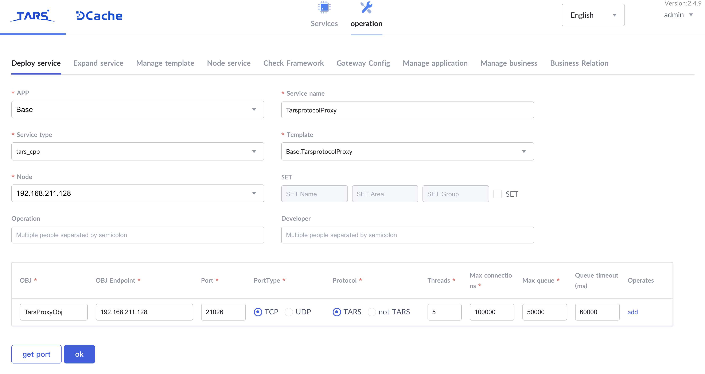
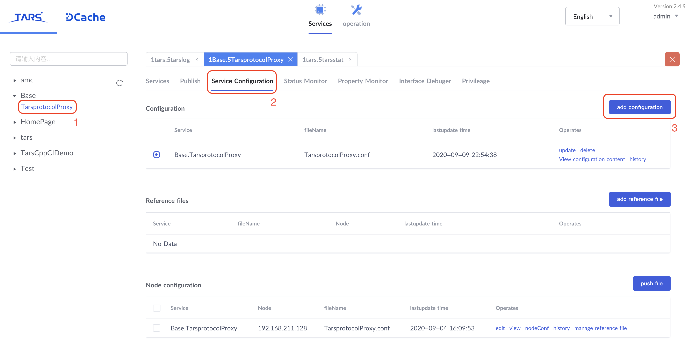
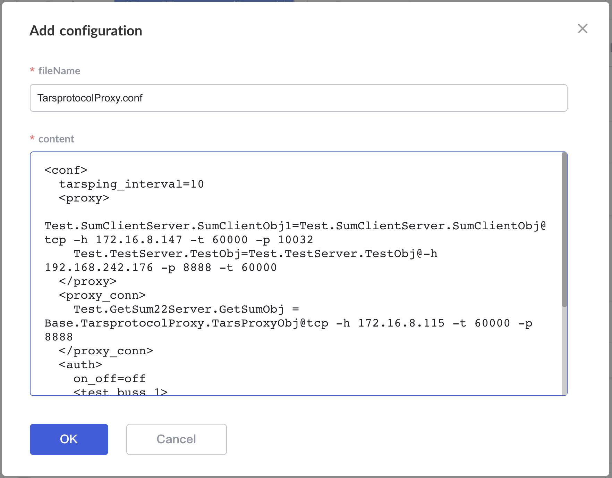
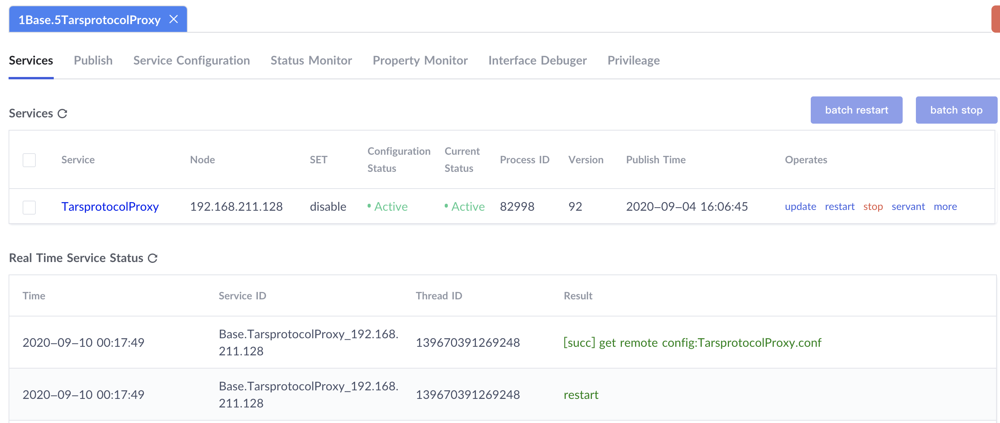

[中文版](README.md)

# ProtocolProxyServer

A tars protocol proxy that supports the tars-tars protocol, tars-tup protocol, and tars-json protocol.

## Table of Contents

- [Application Scenarios](#chapter-1)
- [Principle](#chapter-2)
- [Proxy Configuration](#chapter-3)
- [Deploy](#chapter-4)

## <a id='chapter-1'></a>Application Scenarios

There are two main application scenarios:

1. Forwarding access as tars protocol;
2. Transparent forwarding for TARS requests across IDC.

In addition to supporting basic protocol forwarding, ProtocolProxyServer also provides IP authorization for the called service and interface.

## <a id='chapter-2'></a>Principle

Tarsprotocol Proxy works on the 4th Layer network, which obtains the buffer directly and parses the Tars request packages and forwards them according to fields in the body of request packages. For more information about the format of the request and response package, see the document of [Message Format](https://tarscloud.github.io/TarsDocs_en/base/tars-protocol.html#22-message-format).

## <a id='chapter-3'></a>Proxy Configuration

The configuration file `ProtocolProxyServer.conf` is used to configure the proxy server, which uses the `XML` style, the same as the TARS server's configuration file.

### Root Node

The root node is `conf`. There is an attribute `tarsping_interval`, which is used to configure the interval of the heartbeat request, in seconds, and `0` means to disable. As follows

```xml
<conf>
  tarsping_interval=10
  ...
</conf>
```

In node `conf`, there are `proxy`, `proxy_conn` and `auth` nodes can be configured, which are proxy, keep-alive connection, and IP authentication configuration respectively.

### Proxy Node

In node `proxy`, the proxy information of the server's `Obj` can be configured that the proxy server can forward the request directly without obtaining the address from the registry server.

```xml
<conf>
  ...
  <proxy>
    Test.SumClientServer.SumClientObj1=Test.SumClientServer.SumClientObj@tcp -h 172.16.8.147 -t 60000 -p 10032
  </proxy>
  ...
</conf>
```

### Proxy Connection Node

Node `proxy_conn` can configure which `Obj` use keep-alive connection.

```xml
<conf>
  ...
  <proxy_conn>
    Test.GetSum22Server.GetSumObj = Base.ProtocolProxyServer.TarsProxyObj@tcp -h 172.16.8.115 -t 60000 -p 8888
  </proxy_conn>
  ...
</conf>
```

### Auth Node

Node `auth` can add configuration for IP authentication. In this node, you can add several nodes according to your business and configure for each business. It doesn't matter what the node name is, just keep each unique.

`ip_white_list` and `ip_black_list` are used for global configuration.

```xml
<auth>
  # Enable IP auth with value on, disable with value off.
  # (Any IP can access the server in the cluster with value off, which is normally used in intranet)
  on_off=off

  # Configured by the business for convenient management.
  # The business name here has no actual meaning, as long as it is unique.
  <test_buss_1>
    # obj = white ip
    Test.GetSumServer.GetSumObj=124.74.236.120|124.74.236.122
  </test_buss_1>
  <news>
    News.HelloServer.HelloObj=124.74.236.11|124.74.236.12
  </news>
  # Add IP white and black list globally.
  ip_white_list=1.1.1.1|2.2.2.2
  ip_black_list=3.3.3.3
</auth>
```

### Example

The following is the example for a configuration file

```xml
<conf>
  tarsping_interval=10
  <proxy>
    Test.SumClientServer.SumClientObj1=Test.SumClientServer.SumClientObj@tcp -h 172.16.8.147 -t 60000 -p 10032
    Test.TestServer.TestObj=Test.TestServer.TestObj@-h 192.168.242.176 -p 8888 -t 60000
  </proxy>
  <proxy_conn>
    Test.GetSum22Server.GetSumObj = Base.ProtocolProxyServer.TarsProxyObj@tcp -h 172.16.8.115 -t 60000 -p 8888
  </proxy_conn>
  <auth>
    on_off=off
    <test_buss_1>
      Test.GetSumServer.GetSumObj=124.74.236.120|124.74.236.122
    </test_buss_1>
    <news>
      News.HelloServer.HelloObj=124.74.236.11|124.74.236.12
    </news>
    ip_white_list=1.1.1.1|2.2.2.2
    ip_black_list=3.3.3.3
  </auth>
</conf>
```

## <a id='chapter-4'></a>Deployment

The protocol proxy server is essentially a TARS server, so the deployment process is similar.

### Compile and Build

Execute the following command to compile the server and generate release package.

```sh
mkdir build
cd build
cmake ..
make
make tar
```

### Add Template

In tab `operation -> Manage Template` of TarsWeb, click `add Template`,

- `Template`: Can be customized, here we fill in `Base.ProtocolProxyServer`
- `Parent template`: `tars.default`
- `content`: As follows

```xml
<tars>
	<application>
		<server>
			deactivating-timeout=3000
			openthreadcontext=0
			threadcontextnum=10000
			threadcontextstack=32768
		</server>
		<client>
			sync-invoke-timeout=5000
			async-invoke-timeout=20000
			sample-rate=1000
			max-sample-count=100
			sendthread=1
			recvthread=1
		</client>
	</application>
</tars>
```

Click `OK` to generate the template.

### Deploy Server

In tab `operation -> Deploy service` of TarsWeb

- `APP`: `Base`
- `Service name`: `ProtocolProxyServer`
- `Service type`: `tars_cpp`
- `Template`: `Base.ProtocolProxyServer`
- `OBJ`: `TarsProxyObj`
- `Protocol`: `not TARS`

Click `get port` to automatically generate the port(It is recommended to use a fixed port 8300).



### Upload Configuration

We need to upload the configuration file mentioned before, that the server can load it while starting.

Go to the service configuration of `ProtocolProxyServer` in TarsWeb, and click `add configuration`



Fill in the `fileName` and `content` in the pop-up window



Click `OK` to finish it.

### Publish Server

Go to tab `Publish` of this server to upload the release package and publish the server.


