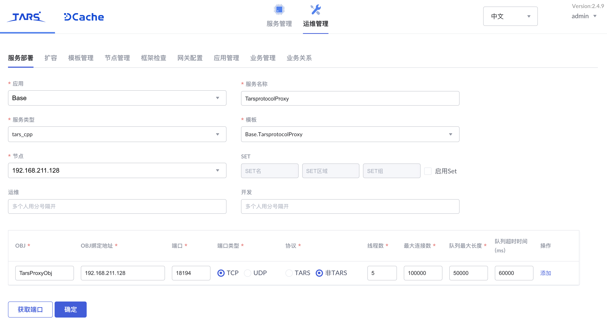
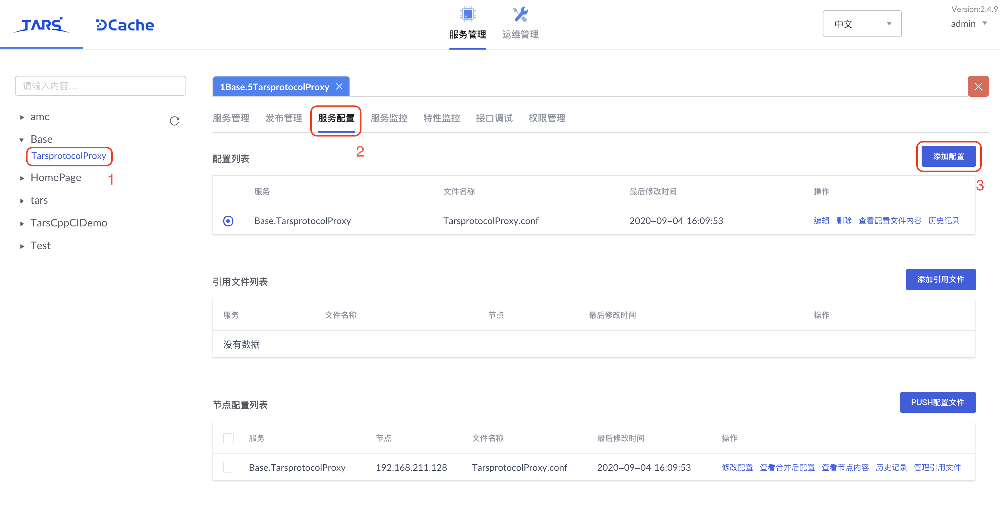
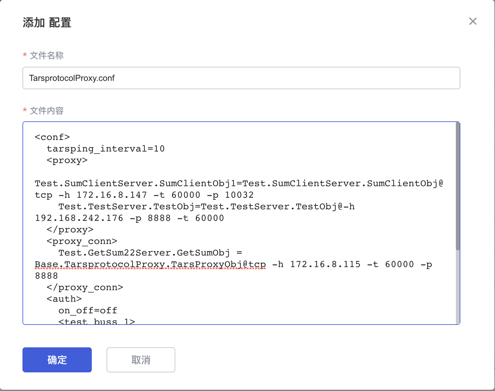
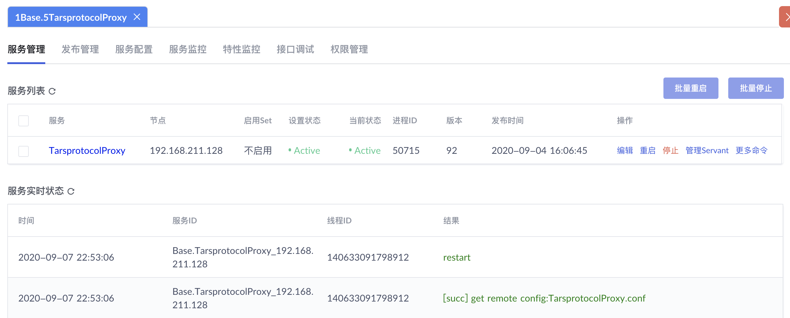

[Read in English](README.en.md)

# Tars协议代理服务 TarsprotocolProxy

在第四层网络上工作的协议代理，支持 `tars-tars` 协议，`tars-tup` 协议和 `tars-json` 协议。

## 应用场景

主要有两个应用场景

  1. 作为 `tars` 协议的四层接入；
  2. 跨 IDC 的 `tars` 请求透明转发。

除了支持基本的协议转发，还能够做被调用的服务及接口 ip 授权。

## 原理

在第四层网络上工作，直接获取 buffer 并解析 Tars 请求包，根据请求包包体字段信息进行转发。请求包和响应包格式可以参见官方文档中的[消息格式](https://tarscloud.github.io/TarsDocs/base/tars-protocol.html#22-%E6%B6%88%E6%81%AF%E6%A0%BC%E5%BC%8F)部分。

## 配置文件

配置文件 `TarsprotocolProxy.conf` 用于配置代理服务，与 TARS 服务 conf 文件格式一致，采用 `xml` 风格。

### 根节点
根节点为 `conf` 节点，可以配置参数 `tarsping_interval` ，用于配置心跳请求的间隔，单位为秒，`0` 表示不启用心跳，如下

```xml
<conf>
  tarsping_interval=10
  ...
</conf>
```

`conf` 节点下可配置 `proxy`, `proxy_conn`, `auth` 节点，分别是代理配置，长链接配置和鉴权黑白名单配置。

### 代理配置

`proxy` 节点下可以配置服务Obj的代理信息，根据配置直接转发，而不从主控获取

```xml
<conf>
  ...
  <proxy>
    Test.SumClientServer.SumClientObj1=Test.SumClientServer.SumClientObj@tcp -h 172.16.8.147 -t 60000 -p 10032
  </proxy>
  ...
</conf>
```

### 长连接

通过 `proxy_conn` 节点可以配置需要长连接的Obj

```xml
<conf>
  ...
  <proxy_conn>
    Test.GetSum22Server.GetSumObj = Base.TarsprotocolProxy.TarsProxyObj@tcp -h 172.16.8.115 -t 60000 -p 8888
  </proxy_conn>
  ...
</conf>
```

### 鉴权配置

`auth` 节点可以添加 IP 鉴权配置信息，包含开关参数 `on_off`， 设置为 `on` 时表示开启访问控制，`off` 表示关闭。

`auth` 节点下可以添加若干节点，方便按业务划分，不同节点名只要不重复即可，没有实际含义；也可以设置全局配置，在 `auth` 节点下配置 `ip_white_list` 和 `ip_black_list` 

```xml
<auth>
  # 是否打开ip授权，on 打开，off 关（关闭的时候，任何ip可以访问集群内的任何服务，一般只有内网转发才会这么配置）
  on_off=off

  # 按业务配置，方便管理，这里业务名没有实际含义，只要不重复即可
  <test_buss_1>
    # obj = white ip
    Test.GetSumServer.GetSumObj=124.74.236.120|124.74.236.122	
  </test_buss_1>
  <news>
    News.HelloServer.HelloObj=124.74.236.11|124.74.236.12
  </news>
    # 全局添加ip白名单,黑名单
    ip_white_list=1.1.1.1|2.2.2.2
    ip_black_list=3.3.3.3
</auth>
```

### 实例

完整的配置文件如下

```xml
<conf>
  tarsping_interval=10
  <proxy>
    Test.SumClientServer.SumClientObj1=Test.SumClientServer.SumClientObj@tcp -h 172.16.8.147 -t 60000 -p 10032
    Test.TestServer.TestObj=Test.TestServer.TestObj@-h 192.168.242.176 -p 8888 -t 60000 
  </proxy>
  <proxy_conn>
    Test.GetSum22Server.GetSumObj = Base.TarsprotocolProxy.TarsProxyObj@tcp -h 172.16.8.115 -t 60000 -p 8888
  </proxy_conn>
  <auth>
    on_off=off
    <test_buss_1>
      Test.GetSumServer.GetSumObj=124.74.236.120|124.74.236.122	
    </test_buss_1>
    <news>
      News.HelloServer.HelloObj=124.74.236.11|124.74.236.12
    </news>
    ip_white_list=1.1.1.1|2.2.2.2
    ip_black_list=3.3.3.3
  </auth>
</conf>
```

## 部署

协议代理服务本质上也是一个Tars服务，因此部署过程与一般的Tars服务类似。

### 编译构建

执行以下命令编译服务并生成发布包

```sh
mkdir build
cd build
cmake ..
make
make tar
```

### 添加模板

协议代理服务需要一些额外的配置，我们需要新增一个模板。

在TarsWeb页面的 `运维管理 -> 模板管理` 中点击 `新增模板` ，弹出窗口中
- `模板` 可以自定，这里我们填写 `Base.TarsprotocolProxy`；
- `父模板名` 选择 `tars.default`；
- `模板内容` 中填写如下内容

```xml
<tars>
	<application>
		<server>
			deactivating-timeout=3000
			openthreadcontext=0
			threadcontextnum=10000
			threadcontextstack=32768
		</server>
		<client>
			sync-invoke-timeout=5000
			async-invoke-timeout=20000
			sample-rate=1000
			max-sample-count=100
			sendthread=1
			recvthread=1
		</client>
	</application>
</tars>
```

点击 `确定`即可生成模板。

### 部署服务

在TarsWeb页面的 `运维管理 -> 服务部署` 中
- 应用名：`Base`
- 服务名：`TarsprotocolProxy`
- 服务类型：`tars_cpp`
- 模板：`Base.TarsprotocolProxy` （上节新建的模板）
- OBJ：`TarsProxyObj`
- 协议：`非TARS`

其他默认即可，端口可点击 `获取端口` 生成，如下



### 上传配置

前面提到的配置文件，需要上传到配置中心，使服务启动时能够拉取相关的代理配置。

在TarsWeb页面进入 `TarsprotocolProxy` 的服务配置，点击 `添加配置`



在弹出窗口填写文件名和代理配置内容



点击 `确定` 即添加完成。

### 发布服务

在TarsWeb页面对应服务的 `发布管理` 中上传服务发布包并发布服务，服务成功发布即Tars协议代理服务部署成功。

